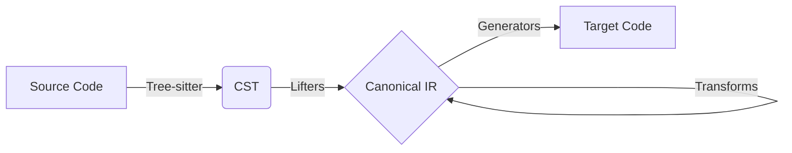

# Code Transpiler Project - Onboarding & Handoff Guide

Welcome! This document is a complete onboarding guide for the multi-language Code Transpiler project. It explains the system architecture, how the pipeline works, the directory structure, our cluster setup, and exactly what recent improvements have been made.

## 1. Project Overview & Architecture

We are building a robust many-to-many code transpiler currently supporting **Python, Java, JavaScript, C, and C++**. 

The transpilation pipeline operates in four distinct stages:
1. **Parsing (Tree-sitter)**: Source code is parsed into a Concrete Syntax Tree (CST) using GitHub's `tree-sitter`.
2. **Lifting**: Language-specific "Lifters" convert the raw tree-sitter CST into our custom, language-agnostic **Canonical IR** (Intermediate Representation).
3. **Transformation (Stage 4)**: The Canonical IR is passed through an engine that applies structural and semantic transformations (e.g., converting Python `range()` to C `for` loops) to make the code compatible with the target language.
4. **Code Generation**: Language-specific "Generators" traverse the transformed Canonical IR and emit the final string of target source code.

## 2. Directory Structure & How Files Work

The codebase is organized modularly based on the pipeline stages:

### `ir/` (Intermediate Representation)
- **`nodes.py`**: Defines the Canonical IR. This is the heart of the project. It contains dataclasses for every AST node (e.g., `Module`, `FunctionDef`, `ForLoop`, `Call`, `Literal`, `BinaryOp`). All lifters output these nodes, and all generators consume them.

### `lifting/` (Source → IR)
Lifters visit tree-sitter nodes and map them to Canonical IR nodes.
- **`python_lifter.py`**: Lifts Python code.
- **`java_lifter.py`**: Lifts Java code.
- **`javascript_lifter.py`**: Lifts JavaScript code.
*(Note: C and C++ currently do not have lifters; they can only be generated as targets).*

### `transforms/` (IR → IR)
- **`engine.py`**: The transformation engine. Contains multiple passes (e.g., `pass_range_to_forloop`, `pass_infer_variable_types`) that alter the IR tree. Transformations are registered based on the specific `source_lang` and `target_lang` combination.

### `codegen/` (IR → Target)
Generators convert Canonical IR back into string code.
- **`base_generator.py`**: Contains the core traversing logic (`_gen()`, `_gen_expr()`) and formatting utilities (indentation).
- **`python_generator.py`**: Emits Python code. Handles Python-specific comments, imports, and indentation.
- **`c_generator.py` / `cpp_generator.py`**: Emits C/C++ code. Handles static typing syntax, braces, and `#include` headers.
- **`java_generator.py`**: Emits Java code, wrapping loose functions in a `TranspiledCode` class.
- **`javascript_generator.py`**: Emits JS code.

### `pipeline/` (Orchestration)
- **`registry.py`**: Wires everything together. Given a source/target pair, it returns the correct Lifter and Generator.
- **`runner.py`**: The main `PipelineRunner` class that executes the full end-to-end pipeline (Parse -> Lift -> Transform -> Generate) for a single snippet.
- **`batch_runner.py`**: A multiprocessing script that runs `PipelineRunner` across massive JSONL chunk files in parallel.

## 3. Cluster Environment Details

All heavy processing happens on the remote SLURM cluster. 
- **User**: `iitgn_pt_data@slurm.dev.soket.ai`
- **Codebase Path**: `~/transpiler/code/code_transpiler/`
- **Dataset Path**: `/projects/data/datasets/code_data/codeLLM_data/iitgn_pt_transpiler/`
  - Input chunks: `output/chunks/out_*.jsonl`
  - Transpiled (v2) chunks: `output_v2/chunks/out_*.jsonl`
- **Conda Environment**: Always activate the environment before running scripts: `conda activate transpiler_env`. This environment contains `tree-sitter`, Python wrappers, Node.js, and `javac`.

## 4. What We Achieved Recently (Stage 4)

We recently realized that simple 1-to-1 syntax generation hits a ceiling because language idioms don't map directly (e.g., Python web frameworks to C, or dynamically typed vars to statically typed vars). We implemented **"Stage 4" structural fixes**:

1. **Transforms Added (`transforms/engine.py`)**:
   - Type inference for C/C++ targets (`x=5` -> `int x=5`).
   - `range()` to C-style `for` loops.
   - `input()` to C `printf/scanf`.
   - Stripping Python dunders (`__name__`) and typing annotations (`Optional`).
   - String method mapping (`.lower()` to `str_lower()`).

2. **Lifter & Generator Bug Fixes**:
   - Fixed a double-import bug in `python_generator.py` (`# import import React`).
   - Fixed `javascript_lifter.py` to properly handle callback functions (`function(err, data){...}`) and template literals.
   - Fixed `base_generator.py` multiline string escaping which was crashing C compilers.

3. **Batch Run**: 
   - We successfully ran `pipeline/batch_runner.py` on the entire 526,908 row dataset, achieving a **94% transpilation rate** (syntax conversion success, prior to strict compiler validation). Results are saved in `output_v2`.

## 5. Next Steps for the Current Session

If you are picking up this project, your immediate next steps are:

1. **Evaluate v2 Benchmark**: Run `python3 /tmp/benchmark_v2.py` on the cluster to calculate the exact compilation-success rate for all 8 language pairs using the new `output_v2` dataset.
2. **Add New Targets**: Add **TypeScript** (by reusing the JS generator/lifter logic) and **C#** (by reusing the Java logic).
3. **Add C/C++ as Source**: Write lifters for C and C++ so we can transpile *from* them.
4. **LLM Repair Loop**: Integrate a CodeLLM that acts as a compiler feedback loop to automatically fix generated code that fails to compile.
